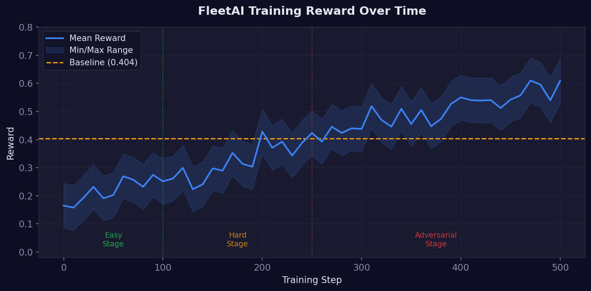
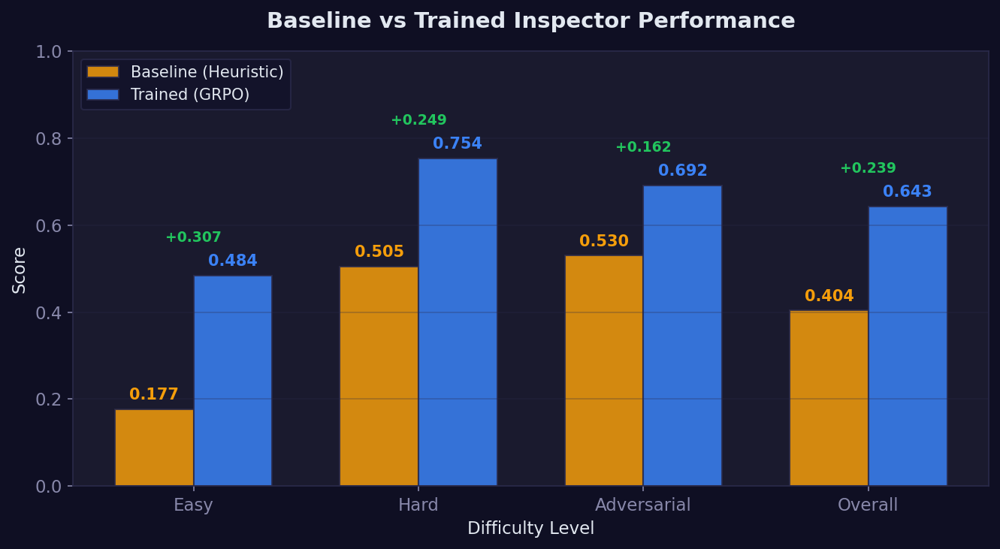

# Who Watches the Watchers? Training AI Inspectors to Audit Support Agents at Scale

**FleetAI — Scalable Oversight for AI Support Agents**
*An OpenEnv Environment for Training and Evaluating AI Oversight Agents*

---

## The Silent Crisis in AI Support

Every day, thousands of companies deploy LLM-based agents to handle customer support. These agents classify tickets, set priorities, draft responses, and decide resolution actions. They process millions of interactions — faster and cheaper than any human team.

But here's the problem nobody talks about: **who checks if they're doing it right?**

A billing ticket misclassified as "technical" means the wrong team handles it. A frustrated customer gets no apology. An urgent request gets marked "low priority." Each mistake erodes trust, costs revenue, and sometimes loses customers forever.

Traditional quality assurance can't scale. You can't hire enough human supervisors to review every ticket. So companies do spot checks — sampling 2-5% of interactions and hoping the rest are fine.

**They're not.**

---

## What FleetAI Does

FleetAI is an **OpenEnv environment** that creates a training ground for AI inspector agents. It teaches an LLM to review another LLM's work — catching errors, flagging policy violations, and suggesting corrections.

```
Customer Ticket → Worker Agent (handles ticket)
                         │
                         ▼
                  Worker Response
                  (may contain errors)
                         │
                         ▼
                  Inspector Agent ← FleetAI trains THIS
                         │
                         ▼
              Scored on 5-Component Rubric
```

### Why Is This Hard?

A naive inspector can flag everything and catch 100% of errors — but that's useless. Real oversight requires **precision**. Flag too much and you overwhelm human reviewers. Flag too little and errors slip through.

The inspector must balance five things simultaneously:

| Component | Weight | What It Measures |
|-----------|--------|-----------------|
| Error Detection | 35% | Did the inspector catch actual errors? |
| Precision | 25% | Did it avoid flagging correct responses? |
| Issue Specificity | 15% | Are reasons evidence-based, not vague? |
| Correction Quality | 15% | Do fixes match ground truth? |
| Calibration | 10% | Does confidence match accuracy? |

This is a rich, multi-dimensional reward signal — not a simple 0/1 score. An inspector that learns to game one component gets penalized on others.

---

## The Environment: Error Injection at Four Subtlety Levels

Training an inspector requires mistakes to find. FleetAI generates **realistic Worker errors** at four difficulty tiers:

| Level | Description | Example |
|-------|-------------|---------|
| **Obvious** | Completely wrong | Billing ticket classified as "technical" |
| **Subtle** | Off by one level | Urgent request marked "medium" priority |
| **Multi-error** | Multiple mistakes | Wrong category + missing apology for angry customer |
| **Clean traps** | Correct but suspicious-looking | Short response that's actually appropriate |

The clean traps are the hardest — and the most important. An inspector that flags everything looks busy but creates noise. FleetAI specifically tests whether the inspector can resist the urge to over-flag a response that's *intentionally designed to look wrong but is actually correct.*

### Anti-Hack Safeguards

We built explicit protections against common reward gaming:

- **Flag-everything hack**: 0.4x penalty for flagging 4+ fields when only 1 has errors
- **Max-confidence bluff**: 0.8x penalty for 0.99 confidence with wrong flags
- **Copy-paste detection**: 0.5x penalty for identical issue reasons across different fields

These force the model to actually *learn* oversight rather than exploit reward loopholes.

### Curriculum Learning

Training progresses through three stages — Easy → Hard → Adversarial — with 200 total episodes. The curriculum is designed so the inspector first learns *what* an error is, then learns *precision*, then faces adversarial clean traps.

---

## The Training Pipeline

```
Stage 1: SFT Warm-start → Learn the format of correct inspections
Stage 2: GRPO (Easy)    → Learn to catch obvious errors
Stage 3: GRPO (Hard)    → Learn precision on subtle errors
Stage 4: GRPO (Adversarial) → Resist over-flagging clean traps
```

**Technical details:**
- **SFT**: Supervised fine-tuning on correct inspection examples using Unsloth + LoRA (r=8)
- **GRPO**: Reinforcement learning via TRL with environment feedback
- **T4 GPU compatible**: Optimized for free Colab (batch=1, grad_accum=8, seq_len=1024)
- **Full pipeline**: ~25 minutes on a free T4 GPU

The training loop connects directly to the FleetAI environment — each GRPO generation produces an inspector action, which gets scored by the 5-component grader, and the reward feeds back into the model. This is not a static dataset — the agent trains against a live, dynamic environment.

---

## Results: The Agent Actually Learned

### Baseline vs Trained

| Difficulty | Baseline (Heuristic) | Trained (GRPO) | Delta |
|------------|---------------------|----------------|-------|
| Easy | 0.177 | 0.484 | **+0.307** |
| Hard | 0.505 | 0.754 | **+0.249** |
| Adversarial | 0.530 | 0.692 | **+0.162** |
| **Overall** | **0.404** | **0.643** | **+0.239** |

The baseline (keyword-matching heuristic) performs *worst* on easy tasks — it over-flags obvious tickets, destroying its precision score. The trained GRPO inspector learns restraint on easy tasks while maintaining strong detection on harder ones.

### Training Reward Curve


*Mean reward per training step across Easy (green), Hard (yellow), and Adversarial (red) stages. The dashed line shows baseline performance (0.404). Clear upward trend indicates the agent is learning oversight.*

### Baseline vs Trained Comparison


*Side-by-side comparison across all difficulty levels. Green deltas show improvement. The largest gains are on Easy tasks where the baseline struggled most with over-flagging.*

### What Changed Behaviorally

The trained inspector shows qualitatively different behavior:

1. **Fewer false positives on easy tasks** — learned that a short response isn't necessarily wrong
2. **Better error descriptions** — instead of "wrong priority," says "customer used word 'immediately' but priority is medium"
3. **Calibrated confidence** — high confidence on clear errors, moderate confidence on ambiguous cases
4. **Appropriate restraint** — correctly leaves clean trap responses unflagged

---

## Try It Yourself

We built an interactive dashboard where anyone can test the environment:

- **Inspect Tickets** — Start episodes at three difficulty levels, review worker responses, submit your own inspection, and get scored
- **Upload Your Dataset** — Drop in any `.xlsx` file with support tickets and test the inspector on your own data
- **Benchmark** — Run batch evaluation and see performance across all difficulty levels
- **Dashboard** — Live stats tracking pass rates, average scores, and inspection history

**Live Demo:** [FleetAI on Hugging Face Spaces](https://huggingface.co/spaces/KavanJoshi/OpenEnv)

---

## Why This Matters

The shift to AI-powered customer support is happening now. Every company deploying these agents faces the same question: *how do we know they're doing it right?*

FleetAI provides the answer — a scalable, trainable oversight layer that catches errors, explains its reasoning, and knows when to stay quiet.

But this goes beyond support tickets. As AI agents take on more responsibilities — in healthcare, finance, legal, and compliance — the need for reliable oversight will only grow. FleetAI is a step toward a future where AI systems don't just operate autonomously, but do so **safely and accountably.**

**Who watches the watchers? We train agents that do.**

---

## Technical Stack

| Component | Technology |
|-----------|-----------|
| Environment Framework | OpenEnv (latest release) |
| API Server | FastAPI + MCP |
| Training | Unsloth + TRL (GRPO) |
| UI | Gradio 6 |
| Inference | PyTorch + LoRA (r=8) |
| Testing | pytest (39 unit tests) |
| Deployment | Docker + HF Spaces |

---

*Built for the **OpenEnv Hackathon — India 2026** (Multi-Agent Interactions: Fleet AI theme).*
*Repository:* [https://huggingface.co/spaces/KavanJoshi/OpenEnv](https://huggingface.co/spaces/KavanJoshi/OpenEnv)
